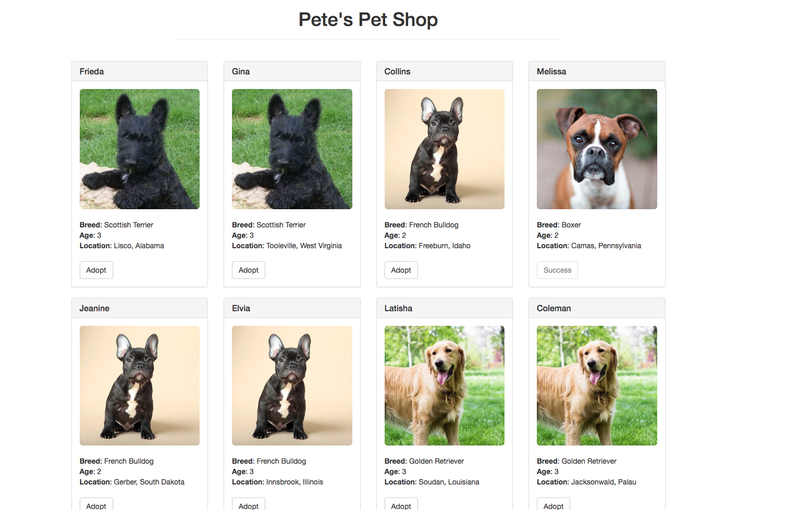

# Demo2: pet-shop

[中文版](doc/zh/README_zh.md)

This demo shows how to deploy the [pet-shop-box](https://github.com/truffle-box/pet-shop-box) on `AppChain`.

> Notice: This tutorial is for the developers who is able to build webapps and has basic knowledge of Blockchain and Smart Contract.

We **highly recommend** you to get familiar with the offical [pet-shop-box-tutorial](https://truffleframework.com/tutorials/pet-shop) first, this will help you fully understand what's going on in this demo.

The final project looks like

```shell
├── README.md
├── package.json
├── node_modules
├── build
│   ├── contracts
│       ├── Adoption.json
│       ├── Migrations.json
├── contracts
│   ├── Adoption.sol
│   ├── Migration.sol
├── migrations
│   ├── 1_initial_migration.js
│   ├── 2_deploy_contracts.js
├── src
│   ├── css
│       ├── bootstrap.min.css
│       ├── bootstrap.min.css.map
│   ├── fonts
│       ├── glyphicons-halflings-regular.eot
│       ├── glyphicons-halflings-regular.svg
│       ├── glyphicons-halflings-regular.ttf
│       ├── glyphicons-halflings-regular.woff
│       ├── glyphicons-halflings-regular.woff2
│   ├── images
│       ├── boxer.jpeg
│       ├── french-bulldog.jpeg
│       ├── golden-retriever.jpeg
│       ├── scottish-terrier.jpeg
│   ├── pics
│   ├── js
│       ├── app.js
│       ├── bootstrap.min.js
│       ├── bundle.js
│   ├── index.html
│   ├── pets.json
├── test
│   ├── TestAdoption.sol
├── box-img-lg.png
├── box-img-sm.png
├── bs-config-json
├── LICENSE
├── truffle-box.json
├── truffle-config.js
├── truffle.js
└── yarn.lock
```

# How to run this demo

## 0. Setting up the development environment
There are a few technical requirements before we start. Please install the following:

Node.js v6+ LTS and npm (comes with Node)

Once we have those installed, we only need one command to install Truffle:

```shell
npm install -g truffle
```

## 1. Download repo

Download this repo.

```shell
git clone https://github.com/cryptape/dapp-demos.git
```

Change directory to pet-shop.

```shell
cd dapp-demos
cd pet-shop
```

## 2. Install all dependencies

```shell
yarn install
```

## 3. Configuration

Create `src/js/config.js` and `truffle.js`.

```shell
cp src/js/config.js.example src/js/config.js
```

```shell
cp truffle.js.example truffle.js
```

## 4. Compile the contract

```shell
truffle compile
```

on windows

```shell
truffle.cmd compile
```

You will get a new folder named build.

## 5. Deploy the contract

> Notice: We use [AppChain-Truffle-Migrate](https://github.com/cryptape/appchain-truffle-migrate) to deploy the contract, so the commend is different from `truffle-box`.

```shell
yarn migrate
```

If your terminal shows informations below means you successfully deployed the contract.

```shell
> appchain-migrate migrate

Using network 'development'.

Running migration: 1_initial_migration.js
  Deploying Migrations...
transaction hash of deploy contract:  0x2cfce2e5ce5bf8b76fc84108e1efc84666c5d80fa9f61c0fd157b67cfcde3396
  Migrations: 0x22497a741b3A0acB9379B42B6b8BE2a4AAA9aA76  // contract address may be different
Saving artifacts...
Running migration: 2_deploy_contracts.js
  Deploying Adoption...
transaction hash of deploy contract:  0x32948be9eb8422d09e4faac78e2b76871bc0c0f1b457d688e23290a400d97065
  Adoption: 0x6FA9e49Af3De8BEbC5eD2b100E8670E064ecA23c // contract address may be different
Saving artifacts...
```

## 6. Run the server

### Dev mode

Deploy pet-shop on local server.

```shell
npm run dev
```

If everything works well, you will automatically jump to a web page like this:



After you click the Adopt button under any dog pic, browser will alert 'Waiting for transaction result', after click the confirm button another alert will tell you 'Transaction Done!'.

The Adopt button will becomes disabled and the text will change to 'Success'. Melissa in the first row is an example.

### Product mode

<<<<<<< HEAD
>Notice: You should config your server address in `./src/js/config.js` and `truffle.js` first.
=======
>Notice: You should config your server address in `./src/manifest.json` , `./src/js/config.js` and `truffle.js` first.
>>>>>>> cf315606505c3dbbdf80761af9a1c94128e86990

Deploy your pet-shop to your server.

### 1. Move your compiled contract to src folder

```shell
mv ./build/contracts/Adoption.json ./src/     
```

### 2. Modify Adoption.json's path in src/js/app.js

```shell
cd src/js
```

Modify 'Adoption.json' to '../Adoption.json' in `initContract` method in `app.js`

```JavaScript
// app.js
initContract: () => {
    // $.getJSON('Adoption.json', (data) => {
    $.getJSON('../Adoption.json', (data) => {
        const AdoptionArtifact = data;
```


### 3. Pack and rename `src` folder

```shell
pet-shop > mv src pet-shop   // rename `src` folder name to `pet-shop`
pet-shop > tar -zcvf pet-shop.tar.gz pet-shop  // pack `pet-shop`
```

### 4. Upload pet-shop.tar.gz to server

```shell
scp pet-shop.tar.gz user@remote:/tmp  //use your own server address
```

### 5. Login your server

```shell
ssh user@remote //use your own server address
```

### 6. Unpack pet-shop

```shell
cd /tmp
mv pet-shop.tar.gz /var/www
cd /var/www
tar -zxvf pet-shop.tar.gz  // Unpack pet-shop
```

### 7. Use a static files server, e.g. [NGINX](https://www.nginx.com/) to serve the pet-shop directory

---

# Where are the differences

From here, we assume you already read the [pet-shop-box-tutorial](https://truffleframework.com/tutorials/pet-shop), cause we will **focus on different parts** between these two demos.

> Notice: This demo use `nervos.js` instead of `web3.js` to interact with `AppChain`. **You can find `nervos.js` [here](https://github.com/cryptape/nervos.js/tree/develop/packages/nervos-chain).**

## src/index.html

```html
<script src="js/bootstrap.min.js"></script>
<script src="js/bundle.js"></script>
<script src="js/config.js"></script>
<script src="js/app.js"></script>
```

```
+ bundle.js
+ config.js
- web3.min.js
- truffle-contract.js
```

[bundle.js](src/js/bundle.js) is a JavaScript file for browser to use `nervos.js`.

[config.js](src/js/config.js) is a JavaScript file to confige your chain and private key.

## src/app.js

### Instantiating nervos.js

```JavaScript
const nervos = Nervos(config.chain)
```

`nervos.js` interacts with `AppChain`. It can retrieve user accounts, send transactions, interact with smart contracts, and more.

No more need for `initWeb3`.

### Instantiating the contract

```JavaScript
App.contracts.Adoption = new nervos.appchain.Contract(AdoptionArtifact.abi, contract_address)
```

Create contract instance by using `abi` and deployed `contract address`.

### Getting The Adopted Pets and Updating The UI

```JavaScript
App.contracts.Adoption.methods
  .getAdopters()
  .call()
  .then(() => {
    // do something
  })
  .catch(err => {
    console.log(err)
  })
```

`getAdopters` is a method name written in the contract.

We can use `App.contracts.Adoption.methods.methodName`, to call the method in deployed contract.

### Handling the adopt() Function

```JavaScript
const transaction = {
  from: '0x46a23E25df9A0F6c18729ddA9Ad1aF3b6A131160',
  privateKey: config.privateKey,
  nonce: 999999,
  quota: 1000000,
  data: App.contracts.bytecode,
  chainId: 1,
  version: 0,
  validUntilBlock: 999999,
  value: '0x0',
}
```

`transaction` object provide some configuration options to interact with `AppChain`.

For more details about `transaction` object, please refer to [JSON-RPC](https://docs.nervos.org/cita/#/rpc_guide/rpc).

```JavaScript
nervos.appchain.getBlockNumber().then(res => {
  const num = Number(res)
  transaction.validUntilBlock = num + 88
})
```

Check the `block height` right now and update `validUntilBlock`, if transaction doesn't executed after `validUntilBlock`, then we can say `transaction` failed.

```JavaScript
App.contracts.Adoption.methods.adopt(petId).send(transaction)
```

Call `adopt` method and send `transaction` to `AppChain`.

```JavaScript
return nervos.listeners.listenToTransactionReceipt(result.hash)
```

Polling to get `transaction receipt` by using `transaction hash`.

```JavaScript
;(receipt => {
  if (receipt.errorMessage === null) {
    console.log('Transaction Done!')
    alert('Transaction Done!')
    return App.markAdopted()
  } else {
    throw new Error(receipt.errorMessage)
  }
}).catch(err => {
  console.log(err.message)
})
```

If `receipt` received and no error message appear, then call `markAdopted` method, or throw the error.

# Run with NeuronWeb

To run with [neuronWeb]('https://github.com/cryptape/nervos.js/tree/develop/packages/neuron-web'), simply add following code in `app.js`

```javascript
window.addEventListener('neuronWebReady', () => {
  window.console.log('neuron web ready')
  window.addMessenger(nervos)
})
```

Then the dapp is able to access default account by `nervos.appchain.getDefaultAccount`, by that `from` can be omitted in transaction.

```javascript
const transaction = {
  // from: '0x46a23E25df9A0F6c18729ddA9Ad1aF3b6A131160',
  privateKey: config.privateKey,
  nonce: 999999,
  quota: 1000000,
  data: App.contracts.bytecode,
  chainId: 1,
  version: 0,
  validUntilBlock: 999999,
  value: '0x0',
}
nervos.appchain.getDefaultAccount().then(defaultAccount => {
  transaction.from = defaultAccount
  return
})
```

Since `neuronWeb` will sign the transaction, `privateKey` can be removed from the dapp.

```javascript
const transaction = {
  // from: '0x46a23E25df9A0F6c18729ddA9Ad1aF3b6A131160',
  // privateKey: config.privateKey,
  nonce: 999999,
  quota: 1000000,
  data: App.contracts.bytecode,
  chainId: 1,
  version: 0,
  validUntilBlock: 999999,
  value: '0x0',
}
```

That's all adjustments to run with `neuronWeb`.

## Steps

### 1. Install neuronWeb chrome extension


### 2. Switch wallet and enter private key


You will back to the first page after enter the private key.

The page will show transactions happened before.


### 3. Make transaction

Click `Adopt` button in pet shop page like you did before, a popup page shows transaction informations, then click `submit` wait for transaction done.


