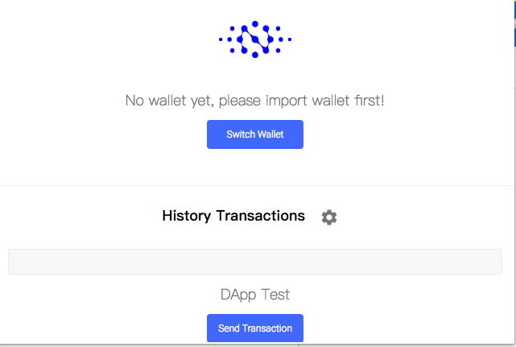
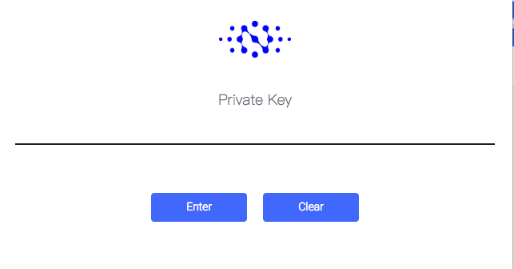
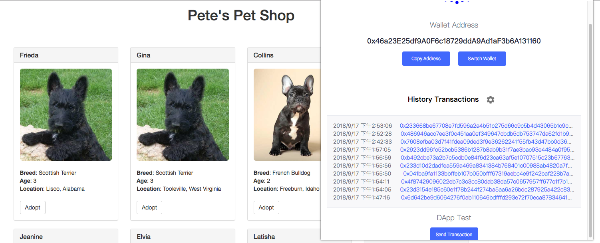
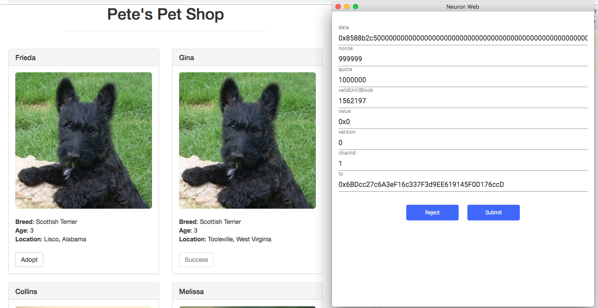

# Demo2: pet-shop

这个 demo 展示如何将 `truffle-box` 的官方实例 [ pet-shop-box](https://github.com/truffle-box/pet-shop-box) 部署到 `AppChain` 上。

> 注意：本教程是给有一定 web 应用开发经验以及对区块链，智能合约开发有所了解的开发者准备的。

我们**强烈建议**先学习下 [pet-shop-box 官方教程](https://truffleframework.com/tutorials/pet-shop)，这将有助于理解整个 demo。

最终的 demo 文件夹结构如下：

```shell
├── README.md
├── package.json
├── node_modules
├── build
│   ├── contracts
│       ├── Adoption.json
│       ├── Migrations.json
├── contracts
│   ├── Adoption.sol
│   ├── Migration.sol
├── migrations
│   ├── 1_initial_migration.js
│   ├── 2_deploy_contracts.js
├── src
│   ├── css
│       ├── bootstrap.min.css
│       ├── bootstrap.min.css.map
│   ├── fonts
│       ├── glyphicons-halflings-regular.eot
│       ├── glyphicons-halflings-regular.svg
│       ├── glyphicons-halflings-regular.ttf
│       ├── glyphicons-halflings-regular.woff
│       ├── glyphicons-halflings-regular.woff2
│   ├── images
│       ├── boxer.jpeg
│       ├── french-bulldog.jpeg
│       ├── golden-retriever.jpeg
│       ├── scottish-terrier.jpeg
│   ├── pics
│   ├── js
│       ├── app.js
│       ├── bootstrap.min.js
│       ├── bundle.js
│   ├── index.html
│   ├── pets.json
├── test
│   ├── TestAdoption.sol
├── box-img-lg.png
├── box-img-sm.png
├── bs-config-json
├── LICENSE
├── truffle-box.json
├── truffle-config.js
├── truffle.js
└── yarn.lock
```

# 如何让 demo 跑起来

## 0. 环境的安装
请预先安装好Node.js v6+ LTS 以及 npm

之后全局安装 Truffle:

```shell
npm install -g truffle
```

## 1. 下载仓库

下载仓库。

```shell
git clone https://github.com/cryptape/dapp-demos.git
```

进入 pet-shop 文件夹。

```shell
cd dapp-demos
cd pet-shop
```

## 2. 安装依赖

```shell
yarn install
```

## 3. 配置参数

创建 `src/js/config.js` 和 `truffle.js`。

```shell
cp src/js/config.js.example src/js/config.js
```

```shell
cp truffle.js.example truffle.js
```

## 4. 编译合约

```shell
truffle compile
```

项目文件夹中将会生成一个新的文件夹 build。

## 5. 部署合约

> 注意: 我们使用 [AppChain-Truffle-Migrate](https://github.com/cryptape/appchain-truffle-migrate) 来部署合约, 所以使用的命令与 `truffle-box` 有所不同。

```shell
yarn migrate
```

如果终端显示以下信息，代表已经成功部署合约。

```shell
> appchain-migrate migrate

Using network 'development'.

Running migration: 1_initial_migration.js
  Deploying Migrations...
transaction hash of deploy contract:  0x2cfce2e5ce5bf8b76fc84108e1efc84666c5d80fa9f61c0fd157b67cfcde3396
  Migrations: 0x22497a741b3A0acB9379B42B6b8BE2a4AAA9aA76  // contract address may be different
Saving artifacts...
Running migration: 2_deploy_contracts.js
  Deploying Adoption...
transaction hash of deploy contract:  0x32948be9eb8422d09e4faac78e2b76871bc0c0f1b457d688e23290a400d97065
  Adoption: 0x6FA9e49Af3De8BEbC5eD2b100E8670E064ecA23c // contract address may be different
Saving artifacts...
```

## 6. 运行服务器

### 开发模式

将 pet-shop 部署到本地服务器。

```shell
npm run dev
```

如果一切顺利，你将会自动跳转到以下网页。


当你点击任何宠物狗图片下的 Adopt 按钮之后，浏览器会提示 'Waiting for transaction result'，点击确认按钮之后，新的提示会告知你 'Transaction Done!'。

Adopt 按钮将会变成置灰状态，按钮文字部分会变成 'Success'。 就像第一行的 Melissa 那样。

### 生产模式

>注意：远程服务器的地址需要在 `./src/manifest.json` 以及 `truffle.js` 中预先配置。

将 pet-shop 部署到远程服务器。

### 1. 移动编译后的合约文件

mv ./build/contract/Adoption.json ./src/     // 将编译后的合约移动到 src 目录

### 2. 修改 src/js/app.js 文件中 Adoption.json 的路径

cd src/js

将 app.js 文件中第 32 行的 'Adoption.json' 改成 '../Adoption.json'

### 3. 打包并重命名 `src` 文件夹，上传至服务器

pet-shop > tar -zcvf pet-shop.tar.gz src

### 4. 将 pet-shop.tar.gz 上传到服务器

scp pet-shop.tar.gz user@remote:/tmp  //用自己的服务器地址替换这个地址

### 5. 连接上服务器

ssh user@remote //用自己的服务器地址替换这个地址

### 6. 将 pet-shop 解压到相应的位置

cd /tmp
mv pet-shop.tar.gz /var/www
cd /var/www
tar -zxvf pet-shop.tar.gz  // pet-shop 解压完毕

### 7. 起一个静态文件服务器，例如 nginx 来 serve pet-shop 目录

---

# 区别在哪

从这部分开始，我们假设你已经阅读过 [pet-shop-box 官方教程](https://truffleframework.com/tutorials/pet-shop)， 之后将会着重关注两个 demo 之间**不同的部分**。

> 注意：这个 demo 使用 `nervos.js` 代替 `web3.js` 与 `AppChain` 进行交互。
> **可以在[这里](https://github.com/cryptape/nervos.js/tree/develop/packages/nervos-chain)找到 `nervos.js` 的教程。**

## src/index.html

```html
<script src="js/bootstrap.min.js"></script>
<script src="js/bundle.js"></script>
<script src="js/app.js"></script>
```

```
+ bundle.js
+ config.js
- web3.min.js
- truffle-contract.js
```

[bundle.js](src/js/bundle.js) 是一个将 `nervos.js` 引入浏览器的 JavaScript 文件。

[config.js](src/js/config.js) 是一个配置私钥以及链的 JavaScript 文件。

## src/app.js

### 实例化 nervos.js

```JavaScript
const nervos = Nervos(config.chain)
```

`nervos.js` 库用于和 `AppChain` 交互。它能够实现获取用户账号，发出交易，与智能合约交互，等功能。

不再需要 `initWeb3` 了。

### 实例化合约

```JavaScript
App.contracts.Adoption = new nervos.appchain.Contract(AdoptionArtifact.abi, contract_address)
```

通过使用 `abi` 和已经部署成功的 `contract address` 来初始化合约实例。

### 领养宠物并更新界面

```JavaScript
App.contracts.Adoption.methods
  .getAdopters()
  .call()
  .then(() => {
    // 做些操作
  })
  .catch(err => {
    console.log(err)
  })
```

`getAdopters` 是合约中的方法名。

我们可以使用 `App.contracts.Adoption.methods.methodName` 这种方式，来调用合约中的方法。

### 处理 adopt() 函数

```JavaScript
const transaction = {
  from: '0x46a23E25df9A0F6c18729ddA9Ad1aF3b6A131160',
  privateKey: config.privateKey,
  nonce: 999999,
  quota: 1000000,
  data: App.contracts.bytecode,
  chainId: 1,
  version: 0,
  validUntilBlock: 999999,
  value: '0x0',
}
```

交易对象提供了一些与 `AppChain` 交互的配置参数。

关于交易对象字段的详情, 可以参考 [JSON-RPC](https://docs.nervos.org/cita/#/rpc_guide/rpc)。

```JavaScript
nervos.appchain.getBlockNumber().then(res => {
  const num = Number(res)
  transaction.validUntilBlock = num + 88
})
```

查看目前的区块高度，并且更新 `validUntilBlock` 字段，若这笔交易在 `validUntilBlock` 高度之后还未被执行，则视为失败。

```JavaScript
App.contracts.Adoption.methods.adopt(petId).send(transaction)
```

调用 `adopt` 方法并发送交易到 `AppChain`。

```JavaScript
return nervos.listeners.listenToTransactionReceipt(result.hash)
```

使用交易哈希，轮询获取交易回执。

```JavaScript
;(receipt => {
  if (receipt.errorMessage === null) {
    console.log('Transaction Done!')
    alert('Transaction Done!')
    return App.markAdopted()
  } else {
    throw new Error(receipt.errorMessage)
  }
}).catch(err => {
  console.log(err.message)
})
```

回执获取之后，若果没有错误信息，则调用 `markAdopted` 方法，否则抛出错误。

# 在 neuronWeb 下运行

要让 demo 在 [neuronWeb]('https://github.com/cryptape/nervos.js/tree/develop/packages/neuron-web') 下运行, 只需在 `app.js` 中添加如下代码:

```javascript
window.addEventListener('neuronWebReady', () => {
  window.console.log('neuron web ready')
  window.addMessenger(nervos)
})
```

此时, dapp 就可以通过 `nervos.appchain.getDefaultAccount` 获取 `neuronWeb` 中的默认账号, 因此可以省略交易模板中的 from 字段, 改由动态从 `neuronWeb` 中获取。

```javascript
const transaction = {
  // from: '0x46a23E25df9A0F6c18729ddA9Ad1aF3b6A131160',
  privateKey: config.privateKey,
  nonce: 999999,
  quota: 1000000,
  data: App.contracts.bytecode,
  chainId: 1,
  version: 0,
  validUntilBlock: 999999,
  value: '0x0',
}
nervos.appchain.getDefaultAccount().then(defaultAccount => {
  transaction.from = defaultAccount
  return
})
```

因为 `neuronWeb` 负责对交易签名, `privateKey` 也可以从交易模板中去除。

```javascript
const transaction = {
  // from: '0x46a23E25df9A0F6c18729ddA9Ad1aF3b6A131160',
  // privateKey: config.privateKey,
  nonce: 999999,
  quota: 1000000,
  data: App.contracts.bytecode,
  chainId: 1,
  version: 0,
  validUntilBlock: 999999,
  value: '0x0',
}
```

以上便是运行在 `neuronWeb` 下的全部修改。

## 运行步骤

### 1. 安装 neuronWeb 插件



### 2. 选择钱包以及输入私钥



输入私钥完成后将会回到上级页面。

页面会显示当前账号之前进行过的交易信息。



### 3. 发起交易

点击页面上的 `Adopt` 按钮，弹窗将会显示交易信息，点击 `submit` 等待交易完成。


