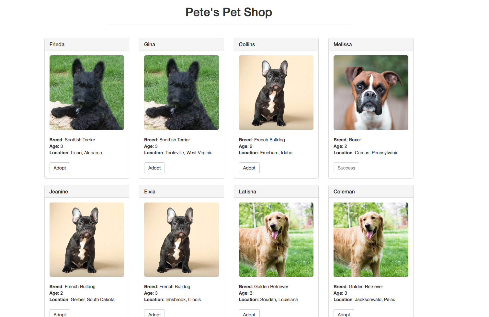

# Demo2: pet-shop

这个 demo 展示如何将 truffle-box 的官方实例 [pet-shop-box](https://github.com/truffle-box/pet-shop-box) 部署到 AppChain 上。

> 注意：本教程是给有一定 web 应用开发经验以及对区块链，智能合约开发有所了解的开发者准备的。

我们**强烈建议**先学习下[pet-shop-box官方教程](https://truffleframework.com/tutorials/pet-shop)，这将有助于理解整个 demo。

最终的 demo 文件夹结构如下：

```shell
├── README.md
├── package.json
├── node_modules
├── build
│   ├── contracts
│       ├── Adoption.json
│       ├── Migrations.json
├── contracts
│   ├── Adoption.sol
│   ├── Migration.sol
├── migrations
│   ├── 1_initial_migration.js
│   ├── 2_deploy_contracts.js
├── src
│   ├── css
│       ├── bootstrap.min.css
│       ├── bootstrap.min.css.map
│   ├── fonts
│       ├── glyphicons-halflings-regular.eot
│       ├── glyphicons-halflings-regular.svg
│       ├── glyphicons-halflings-regular.ttf
│       ├── glyphicons-halflings-regular.woff
│       ├── glyphicons-halflings-regular.woff2
│   ├── images
│       ├── boxer.jpeg
│       ├── french-bulldog.jpeg
│       ├── golden-retriever.jpeg
│       ├── scottish-terrier.jpeg
│   ├── pics
│   ├── js
│       ├── app.js
│       ├── bootstrap.min.js
│       ├── bundle.js
│   ├── index.html
│   ├── pets.json
├── test
│   ├── TestAdoption.sol
├── box-img-lg.png
├── box-img-sm.png
├── bs-config-json
├── LICENSE
├── truffle-box.json
├── truffle-config.js
├── truffle.js
└── yarn.lock
```

# 如何让 demo 跑起来

## 1. 下载仓库

下载仓库。

```shell
git clone https://github.com/cryptape/dapp-demos.git
```
进入 pet-shop 文件夹。

```shell
cd dapp-demos
cd pet-shop
```

完成[初始化配置](https://truffleframework.com/tutorials/pet-shop#setting-up-the-development-environment)。

## 2. 安装依赖

```shell
yarn install
```
## 3. 编译合约

```shell
truffle compile
```

项目文件夹中将会生成一个新的文件夹 build。

## 4. 部署合约
> 注意: 我们使用 [AppChain-Truffle-Box](https://github.com/cryptape/appchain-truffle-box) 来部署合约, 所以使用的命令与 truffle-box 有所不同。

```shell
npm run migrate
```
如果终端显示以下信息，代表已经成功部署合约。

```shell
> appchain-migrate migrate

Using network 'development'.

Running migration: 1_initial_migration.js
  Deploying Migrations...
store abi success
  Migrations: 0xEAa463CB5ed86064CCFE52e468472f88b7eEE24B // 数值可能有所不同
Saving artifacts...
Running migration: 2_deploy_contracts.js
  Deploying Adoption...

store abi success
  Adoption: 0xB48af013Cec674C37e2B4D623c6298efe30C7581 // 数值可能有所不同
Saving artifacts...
```

## 5. 运行服务器

```shell
npm run dev
```
如果一切顺利，你将会自动跳转到以下网页。



当你点击任何宠物狗图片下的 Adopt 按钮之后，浏览器会提示 'Waiting for transaction result'，点击确认按钮之后，新的提示会告知你 'Transaction Done!'。

Adopt 按钮将会变成置灰状态，按钮文字部分会变成 'Success'。 就像第一行的 Melissa 那样。

---
# 区别在哪

从这部分开始，我们假设你已经阅读过 [pet-shop-box官方教程](https://truffleframework.com/tutorials/pet-shop)， 之后将会着重关注两个demo之间**不同的部分**。

> 注意：这个 demo 使用 nervos.js 代替 web3.js 与 AppChain 进行交互。
**可以在[这里](https://github.com/cryptape/nervos.js/tree/develop/packages/nervos-chain)找到 nervos.js 的教程**

## src/index.html

```html
<script src="js/bootstrap.min.js"></script>
<script src="js/bundle.js"></script>
<script src="js/app.js"></script>
```

```
+ bundle.js
- web3.min.js
- truffle-contract.js
```
[bundle.js](src/js/bundle.js) 是一个将 nervos.js 引入浏览器的 JavaScript 文件。

## src/app.js


### 实例化 nervos.js

```js
var nervos = NervosWeb3('http://121.196.200.225:1337')
```
nervos.js 库用于和AppChain交互。它能够实现获取用户账号，发出交易，与智能合约交互，等功能。

不再需要 initWeb3 了。

### 实例化合约

```js
App.contracts.Adoption = new nervos.appchain.Contract(AdoptionArtifact.abi, contract_address)
```

通过使用 abi 和已经部署成功的合约地址来初始化合约实例。

### 领养宠物并更新界面

```js
App.contracts.Adoption.methods.getAdopters().call().then(() => {
    // 做些操作
}).catch((err) => {
    console.log(err)
})
```
getAdopters 是合约中的方法名。

我们可以使用 App.contracts.Adoption.methods.方法名 这种方式，来调用合约中的方法。

### 处理 adopt() 函数

```js
const transaction = {
    from: '0x46a23E25df9A0F6c18729ddA9Ad1aF3b6A131160',
    privateKey: '0xeeeeeeeeeeeeeeeeeeeeeeeeeeeeeeeeeeeeeeeeeeeeeeeeeeeeeeeeeeeeeeee',
    nonce: 999999,
    quota: 1000000,
    data: App.contracts.bytecode,
    chainId: 1,
    version: 0,
    validUntilBlock: 999999,
    value: '0x0'
}
```
交易对象提供了一些与 AppChain 交互的配置参数。

关于交易对象的详情, 可以参考 [nervos.js](https://github.com/cryptape/nervos.js/tree/develop/packages/nervos-chain).

```js
nervos.appchain.getBlockNumber().then((res) => {
    const num = Number(res)
    transaction.validUntilBlock = num + 88
})
```
查看目前的区块高度，并且更新 validUntilBlock 字段，若这笔交易在 validUntilBlock 高度之后还未被执行，则视为失败。

```js
App.contracts.Adoption.methods.adopt(petId).send(transaction)
```
调用 adopt 方法并发送交易到 AppChain。

```js
return nervos.listeners.listenToTransactionReceipt(result.hash)
```
使用交易哈希，轮询获取交易回执。

```js
((receipt) => {
    if(receipt.errorMessage === null) {
        console.log('Transaction Done!')
        alert('Transaction Done!')
        return App.markAdopted()
    } else {
        throw new Error(receipt.errorMessage)
    }
}).catch((err) => {
    console.log(err.message)
})
```
回执获取之后，若果没有错误信息，则调用 markAdopted 方法，否则抛出错误。
